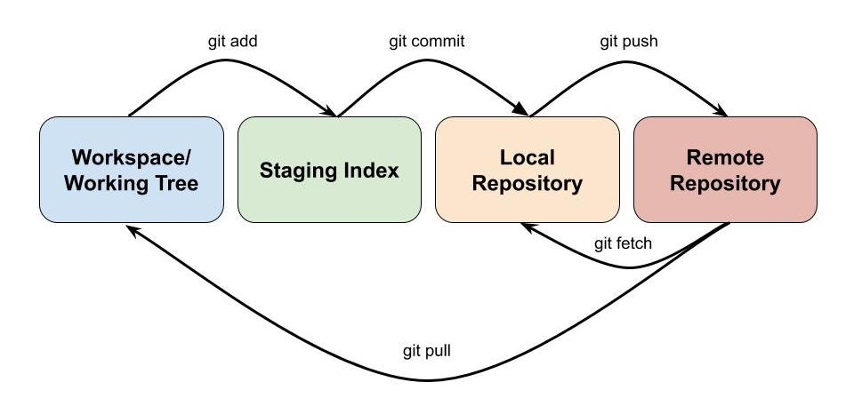

# Changing Code in Git

### Intro
There are various stages when updating code in a repository, and they are easy to mixed up. Before you continue you, it is important to understand some key terminology and the differences between these stages.

The four different stages are:  

* **The Workspace**: Where you update the files in the editor of choice. You are used to just working in a workspace and saving files onto your device. Also refered to as your "working tree". The changes you make in this stage are refered to as `unstaged changes`
* **The Staging Index**: This is where you `add` changes that you are happy with, and are prepared to have incorporated in your repository. The changes you add to this staged are refered to `staged changes`
* **The Local Repository**: When you have completed a feature, or completed a certain task, your next step is to `commit` that change to your local repository. This is refering to the local copy of the repository you have on your device. A commit should have a meaningful message so that users can look back in their commit history and understand what each commit accomplished.
* **The Remote Repository**: When you want to move your local changes up to the main repostiory, you `push` these changes to the Remote Repository. This stage can come with issues (called `merge conflicts`) if other users have made changes at the same time as you and they conflict.

The arrows in the diagram show the commands you will use to move changes between the stages.

### Staged vs Unstaged
You should only stage changes when you are *really* happy with them, and think they are in a state where you could commit them to the repository. If you want to unstage a commit, you can use the following command:  
`git restore --staged <FILE-NAME>`

If you want to see which files have staged or unstaged changes, use the `git status` command to view changes to your working tree. Files that appear in **red** are unstaged, files that appear in **green** are staged. A file can have both staged and unstaged changes if you staged the changes at one point, then continued working on the file.

### Stashing
There may be times when you have some outstanding staged/unstaged changes you aren't ready to commit, but don't want to throw away. That is where `git stash` comes in handy. `git stash` will take the current state of your current uncommitted changes and save them in a temporary "stash" away from your working tree so that you can work on something different. This is a helpful command when  you are wanting to commit changes, but there have been other changes commited by another user that might cause a conflict. 

Some helpful stashing commands are:  

* `git stash save "<ADD-A-NOTE>"` => stashes your current staged and unstaged changes. Write a note for yourself so you remember what is in the stash.
* `git stash push -p -m "<YOUR-STASH-DESCRIPTION>"` => allows you to choose which files to stash.
* `git stash list` => will show you a list of current stashes/
* `git stash pop <STASH-NAME>` => brings your stashed changes back and removes them from the stash.
* `git stash drop <STASH-NAME>` => deletes a specified stash (use with caution)
* `git stash clear` => removes all stashes.

## Commiting
For this section, you are tasked with finding something in the source code to change. Some suggestions of things you can change include: [background colour](https://processing.org/reference/background_.html), [shape colour](https://processing.org/reference/fill_.html), [circle size](https://processing.org/reference/ellipse_.html), [rectangle size](https://processing.org/reference/rect_.html), [line width](https://processing.org/reference/strokeWeight_.html), [line colour](https://processing.org/reference/stroke_.html).

<!--TODO: are they all working in VS or is that just for the non pi people?-->
1. Open Visual Studio (or another IDE) and navigate to `mq_mini_console/src/studentwork`
2. Find an element to change and make that change. Ensure your change is successful before you continue (e.g. if you were trying to change the stroke of a line to be thicker, make sure it's actually thicker).
3. Open a termainal window and navigate to the location of your local clone
4. Run `git status` to view the files you've changed in the workspace
5. If you'd like to view the changes you made run `git diff` or `git diff <FILE-NAME`. The file(s) should appear, some with a (+) and others with a (-) depending on if you removed or added that element to the file. It is a good way of checking your file is in the right condition to stage and/or commit.
6. Move your changes from your workspace to the staging index. There are two ways of doing this:  
  * *If you want to move all the files to the staging index run* `git add .`
  * *If you only want to move one file to the staging index run* `git add <FILE-NAME>`

7. Run `git status` again to check all files you wanted to stage have been staged (staged changes are green)
8. Run `git commit -m "<ADD-YOUR-MESSAGE>"` to move your staged changes to your local repository as a `commit`. Make sure your commit message is meaningful and concise so you can look back and understand what the change was. By convention, commit messages are written as tasks such as *Update the README.md file* or *Complete new character features*.

You can run the `git add` as many times are you want to one commit. You can also run `git commit` as many times as you like before pushing, it will just create lots of seperate commits.

## Pushing
Now that you've commited a change, you will have to push that change back to the remote repository that everyone can see on Bitbucket. This can come with complications if other users have commited from the same point as you (this will be looked at in a later section **Conflicts**). To avoid this for now, make sure each team is working on different files, or coordinate with other members how both of your code should combine.

1. Run `git push` to push all of your commits on your local repository to the remote repository.

**NOTE:** As mentioned above, this might have introduced some *Merge Conflicts*. If that is the case, jump down to the **Conflicts** section and have a read over that to see if you can resolve the merge conflict. This can get quite messy, so don't hesitate to call over one of the supervisors to help guide you through it.

## Pulling
<!--TODO: talk about fetch vs pull. Fetch checks if there are changes to the repo, but doesn't apply anything. Pulling checks AND applies those changes straight away-->

<!--Merge Conflicts-->
<!--Stashing-->
<!--re stashing : 3 scenarios: 
1. You pull, you have unsaved changes (stash)
2. You pull, you've committed (merge conflict)
3. You pull, you have no changes or your commits are unrelated-->

## Conflicts
<!-- Force a conflict-->
<!-- When there is a merge conflict, work with the person you have conflicted with to achieve the best outcome for both commits-->
<!--TODO: Talk about avoiding bad conflicts (pulling regularly, always pulling before making a commit and resolving the conflict yourself) -->

<!--TODO: Maybe add a section on playing around with history?
https://stackoverflow.com/questions/10230469/temporarily-switch-working-copy-to-a-specific-git-commit/10230489#:~:text=First%2C%20use%20git%20log%20to,copy%20to%20a%20specific%20commit.-->

## Extra Notes
### Removing Changes
<!--TODO: Git restore may be a beter alternative-->
Depending on the situation, there are various ways you can remove changes or updates you've made. Here are some sample situations:

* You have unstaged changes **AND/OR** You have staged changes:  
`git reset --hard`
* You have staged changes you want to move back to being unstaged:  
`git reset --mixed`
<!--TODO: Instead could do git restore ?-->
* You want to work from a different stage in your commit history, but not lose the later commits:  
  `git checkout <COMMIT-HASH>` to move to that commit.  
  `git checkout master` once you want to move back to the lastest commit.  
  * *Not reccomended! Only use this if it is completely neccessary. You may run into some merge conflicts later on that will be difficult to recover from*
  <!--TODO: Check this is right and explain commit hash in commits-->
* You want to remove a commit (move back in history):  
	* *Make sure you are* **certain** *when you are doing this. This is not something you should do regularly*
	* *If you are removing the last commit use the following command:*  
	`git reset HEAD^`
	* *If you are removing a commit in the middle of your history things will get complicated and dangerous... [THIS](https://www.clock.co.uk/insight/deleting-a-git-commit) article should help but it introduces topics not covered in this workshop. If you are stuck in this situation and are unsure what to do, ask one of the supervisors for help*
* You have some changes you want to keep, others you don't (this one is a little trickier and involves stashing):  
`git stash push -p -m "<YOUR-STASH-DESCRIPTION>"`
  * 

For more on resetting, have a look at [THIS](https://www.atlassian.com/git/tutorials/undoing-changes/git-reset) resource.

***[Next -> Getting Your Work Incorporated](incorporatingcode.md)***
