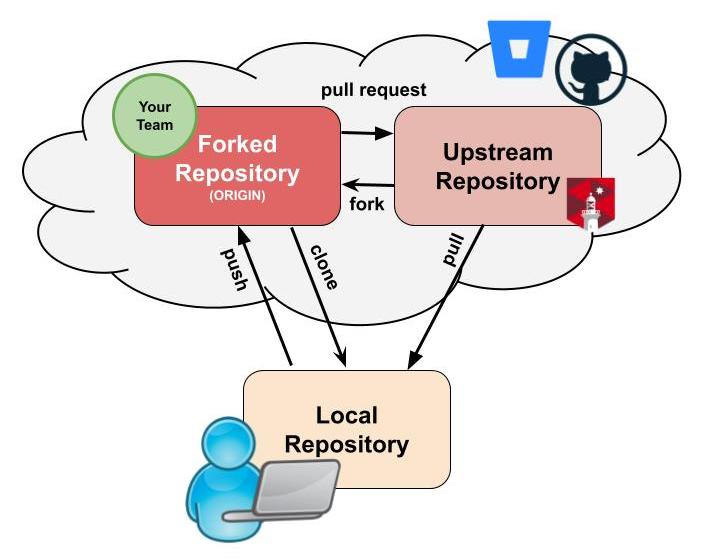
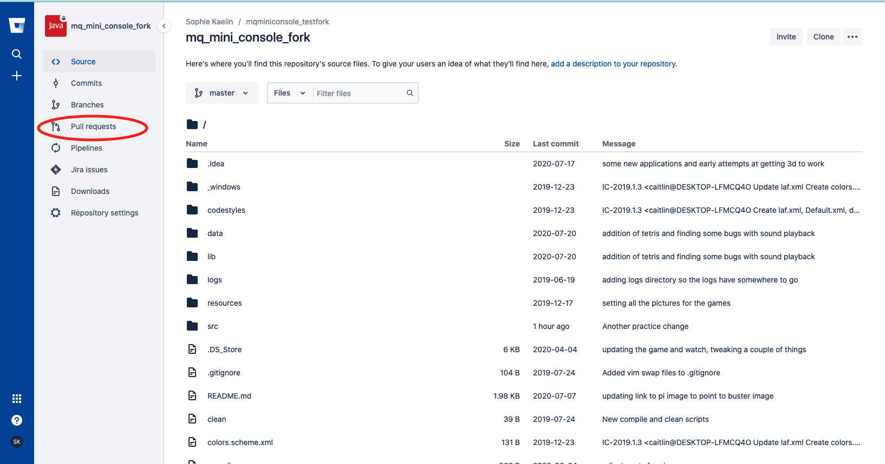
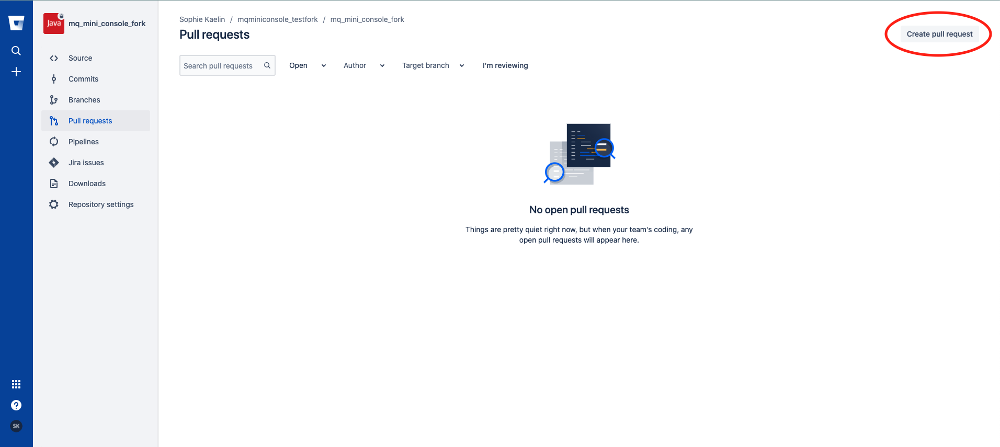
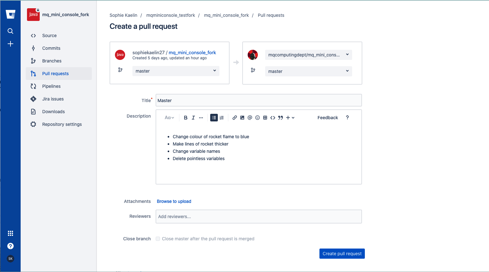

# Getting Your Work Incorporated

At the moment, all your work is sitting on your forked repository. To incorporate your progress with the main repository, you will need to create a **Pull Request**. Before you do that, you will want to make sure your repository and changes are in a complete and finished state that will not introduce bugs or unnecessary code into the main repository.

## Pull Requests. 

<kbd></kbd>

As shown in the above diagram, pull requests are the link from your forked repository back to the original/main repository. It is easiest to do this through the Bitbucket website.

1. Go to your forked repository on Bitbucket
2. Select "Pull requests" on the left side bar  
<kbd></kbd>

3. Select "Create pull request" in the rop right of the screen  
<kbd></kbd>

4. Your pull request description should be automatically populated with some of your commit descriptions. Feel free to unpack them a little more if you feel some more context might be necessary. Give the request a meaningful title  
<kbd></kbd>

5. Create the pull request. 

### What happens now?

Creators of the mini console will review your changes and approve or deny them. Keep any eye out for comments that may be made on how to improve your pull request.

For an insight into what the repository owner see's when you make a pull request, have a look at [THIS]() video.

<!--TODO: Create video demonstrating a pull request.-->

***
**NOTE:** There are lots of open-source projects out there. If you were keen on continuing to work on projects similar to this in your spare time, you can find some of them listed at [THIS](www.firsttimersonly.com/) website. You can clone, make changes and create pull requests for these projects within a friendly and supportive online community. Authors will also sometimes tag issues for beginners to help them get started on projects.

